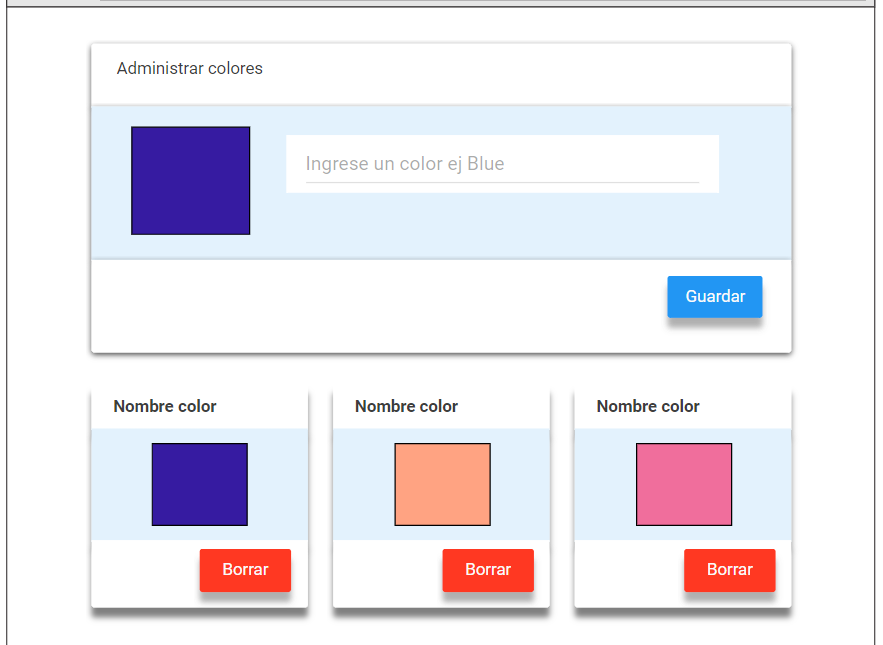

# React + Vite

This template provides a minimal setup to get React working in Vite with HMR and some ESLint rules.

## Trabajo Práctico React

### Ejercicio 6

6. Paleta de colores- Dificultad: 🟢🟡

Crear un proyecto de react que muestre un formulario con un input y un button que permite guardar un color en el localstorage, similar a la siguiente imagen:



---

Utilizamos [React-Bootstrap](https://react-bootstrap.netlify.app/) **v2.9.0** en nuestro proyecto para incoroporar el Container, Form, Button, InputGroup, y usamos el **"bootstrap/dist/css/bootstrap.min.css"** para utilizar los estilos de Bootstrap.

> **IMPORTANTE:** Para ambos casos tenemos que importar estas herramientas con el **import**.

---

Utilizamos el objeto props para mandar información (string y funciones) desde los Componentes padres a los Componentes hijos.

Utilizamos un HOOK que es una función que le da habilidades extras a mi functionalComponent, una de esas es el Estado.

> 📌 useState es el nombre del Hook.

### Repositorio 💻

Los ejercicios se encuentran en el sgte. repositorio:
https://github.com/EmiTorres93/RCS-43i-React_exercise3

- Para clonar el Repositorio:

```bash
git clone https://github.com/EmiTorres93/RCS-43i-React_exercise6
```

- Para contribuir con el proyecto ponerse en contacto con el sgte. mail: **emiliana.mt93@gmail.com**

## Autores

1. Emiliana M. Torres [GitHub](https://github.com/EmiTorres93)
